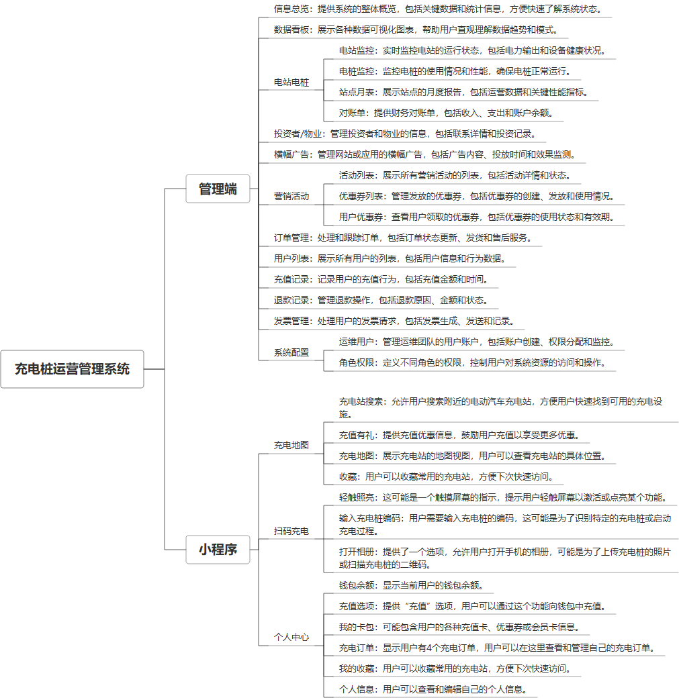

 

    
 

公司拥有上百套具有自主知识产权的软件系统，详情请查看码云首页或公司官网

 
<h1>充电桩运营平台</h1>

<a href="https://www.haishi.net.cn/">公司官网</a> ｜ <a href="https://www.haishi.net.cn/">在线体验</a>

 

## 系统介绍

充电桩运营平台是一款集大屏展示、后台管理和用户服务小程序于一体的综合性系统。该平台通过活动站点关联表、用户表、管理平台用户角色表等众多数据表的精准管理，实现了对充电桩设备、用户账户、充电订单、优惠券、充值权益等全方位业务的监控与运营。大屏端提供实时数据展示，便于站点管理人员监控充电桩状态和站点运营情况；管理端则赋予操作员站点管理、权限控制、财务对账等强大管理功能；小程序端则方便用户进行充电预约、支付、查看充电记录等操作，同时结合微信公众号消息模版表和用户关联表，实现与用户的互动和服务推送，全面提升充电桩运营效率和用户体验。
充电桩运营平台是一款集大屏展示、后台管理和用户服务小程序于一体的综合性系统。该平台通过活动站点关联表、用户表、管理平台用户角色表等众多数据表的精准管理，实现了对充电桩设备、用户账户、充电订单、优惠券、充值权益等全方位业务的监控与运营。大屏端提供实时数据展示，便于站点管理人员监控充电桩状态和站点运营情况；管理端则赋予操作员站点管理、权限控制、财务对账等强大管理功能；小程序端则方便用户进行充电预约、支付、查看充电记录等操作，同时结合微信公众号消息模版表和用户关联表，实现与用户的互动和服务推送，全面提升充电桩运营效率和用户体验。
本项目名称为充电桩运营管理系统，是一个涵盖充电桩运营全流程的管理系统，包括从电站、电桩监控到财务结算、营销活动等多个方面。该系统旨在提高充电桩运营效率，方便用户进行充电，并为运营商提供数据分析和财务管理工具。
本项目包含一个管理后台系统，面向运营管理人员。
- 管理后台：运营管理人员使用，可以进行电站电桩监控、订单管理、用户管理、财务管理、营销活动配置等。
                

## 系统功能介绍

### 系统包含终端说明

管理端（WEB）、用户端（微信小程序）、数据大屏（大屏端）

| 序号 | 模块                | 模块说明 |
| ---- | ------------------- | -------- |
| 1    | FWY-CDZYY-KY-MANAGE | 管理端   |
| 2    | FWY-CDZYY-KY-MP     | 小程序   |
| 3    | FWY-CDZYY-KY-SERVER | 服务端   |

### 系统功能结构

### 系统功能说明

主要功能：
- 信息总览：提供系统关键指标的概览信息。
- 数据看板：对运营数据进行可视化展示和分析。
- 电站电桩监控：实时监控电站和电桩的运行状态，及时发现并处理故障。
- 站点月表/对账单：生成站点月度报表和对账单，方便财务结算。
- 投资者/物业管理：管理投资者和物业信息，进行合作和收益分成。
- 营销活动管理：创建和管理各种营销活动，例如优惠券发放等，吸引用户。
- 订单管理：管理用户的充电订单，包括订单查询、统计等。
- 用户管理：管理用户信息，包括用户注册、认证、充值等。
- 财务管理：管理充值记录、退款记录和发票，进行财务核算。
- 系统配置：配置系统参数，包括角色权限、运维用户等。

## 系统主要界面

## 系统技术说明

### 代码模块说明

| 序号 | 目录                         | 目录说明 |
| ---- | ---------------------------- | -------- |
| 1    | FWY-CDZYY-KY-SERVER/database | --       |
| 2    | FWY-CDZYY-KY-SERVER/entity   | --       |
| 3    | FWY-CDZYY-KY-SERVER/admin    | --       |
| 4    | FWY-CDZYY-KY-SERVER/mapper   | --       |
| 5    | FWY-CDZYY-KY-SERVER/common   | --       |
| 6    | FWY-CDZYY-KY-SERVER/logs     | --       |
| 7    | FWY-CDZYY-KY-SERVER/.mvn     | --       |
| 8    | FWY-CDZYY-KY-SERVER/miniapp  | --       |
| 9    | FWY-CDZYY-KY-SERVER/service  | --       |
| 10   | FWY-CDZYY-KY-SERVER/.idea    | --       |

### 系统技术选型

#### 开发语言/框架

JAVA（JDK1.8）
前端框架：VUE2
前端框架：uni-app

#### 服务中间件

Nginx
Tomcat

#### 数据库

MySQL（5.7+）

#### 其他说明

无

## 系统演示/商用

请扫码添加客服微信获取演示地址和系统详细资料。

如果您想基于充电桩运营平台进行商业化交付或定制开发服务，我们提供有偿的技术服务支持，合作模式不限，欢迎沟通！

公司官网地址： <a href="https://www.haishi.net.cn/">https://www.haishi.net.cn</a>

联系客服获取专业回答。

## 使用须知

1、 本项目商用必须获得版权所有者的授权。

2、 未经允许本项目代码不允许二次出售。

